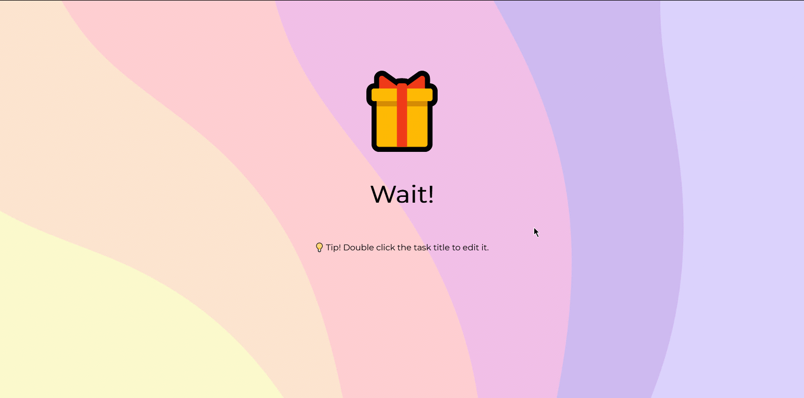

#  Todo App

## [Live](https://serverless-graphql-faunadb-todoapp.netlify.app/)


## Introduction 
Todo App on Gatsby, fetching data from GraphQL server deployed on Netlify Functions with @apollo/client, the GraphQL server gets data from FaunaDB Database, all with TypeScript.

## Setup
- Clone repository
```bash
git clone https://github.com/SaadFarhanIdress/serverless-graphql-faunadb-todoapp
```
- Go to the project directory and install dependencies
```bash
cd serverless-graphql-faunadb-todoapp && npm i && cd functions/graphql/ && npm i
```

- SignUp on FaunaDB

    https://dashboard.fauna.com/accounts/register

- Create a Database

    In the Fauna Cloud Console:
    - Click "New Database"
    - Enter "todos" as the "Database Name"
    - Click "Save"

- Create an Index

    In the Fauna Cloud Console:
    - Select the "todos" database.
    - Navigate to Indexes tab.
    - Click "New Index"
    - Enter "all_todos" as the "Index Name"
    - Click "Save"

- Create a Database Access Key

    In the Fauna Cloud Console:
    - Click "Security" in the left navigation
    - Click "New Key"
    - Make sure that the "Database" field is set to "My Key"
    - Make sure that the "Role" field is set to "Admin"
    - Enter "My Key" as the "Key Name"
    - Click "Save"

- Copy the Database Access Key

- Create `.env` file in `functions/graphql` with the following format:

```env
FAUNADB_SERVER_SECRET={yourFaunaDBKeyHere}
```

- Run Development Server

```bash
npx netlify dev
```

## `envs` for Netlify Deployment
```
Variable name: FAUNADB_SERVER_SECRET
Value: {yourFaunaDBKeyHere}

Variable name: NODE_VERSION
Value: 16.14.2

Variable name: NPM_VERSION
Value: 8.5.0
```
